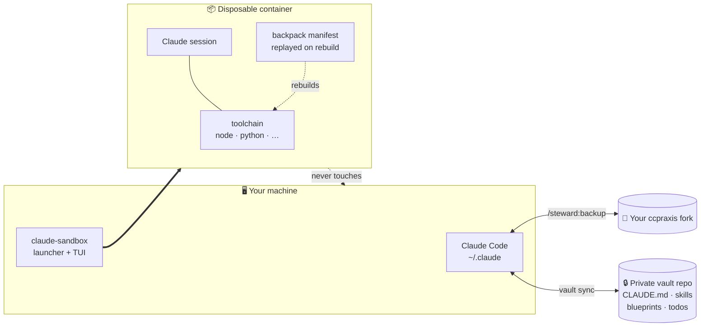

<div align="center">

# PRAXIS for Claude Code

**P**rompts, **R**ules, **A**gents, e**X**tensions, **I**ntegrations, **S**kills

A configuration for Claude Code. It runs your sessions in disposable containers that rebuild themselves, keeps multi-session work on disk instead of in the context window, and enforces its rules with hooks that block the call.

[](https://www.perl.org/)
[](#platforms)
[](#1-a-sandbox-that-manages-itself)
[](LICENSE)
[](https://github.com/andrecarini/ccpraxis/stargazers)
[](https://github.com/andrecarini/ccpraxis/commits/main)

</div>

---

## Contents

- [Problems it solves](#problems-it-solves)
- [Capabilities](#capabilities)
  - [1. A sandbox that manages itself](#1-a-sandbox-that-manages-itself)
  - [2. Work that survives losing the thread](#2-work-that-survives-losing-the-thread)
  - [3. Continuity: finish what you started](#3-continuity-finish-what-you-started)
  - [4. Enforced rules](#4-enforced-rules)
  - [5. Your setup, on every machine](#5-your-setup-on-every-machine)
- [See it](#see-it)
- [Quick start](#quick-start)
- [Commands](#commands)
- [Layout](#layout)
- [Documentation](#documentation)
- [Platforms](#platforms)

---

## Problems it solves

Each of these kept going wrong, and each is now a system in this repo.

| Problem | Detail |
|---|---|
| **Dev tooling on your machine is an attack surface** | One `npm install` runs arbitrary code from hundreds of packages, with your SSH keys, tokens and browser sessions a single `postinstall` away. "Be careful" is not a control. |
| **Telling an agent a rule does not enforce it** | A prohibited `git stash` here swept a finished batch of fixes into a stash that was never restored, while the ledger recorded the step as complete. The instruction was written down. It was violated three times. |
| **Long work loses its thread** | Anything spanning more than one session gets compacted, and what you decided (and why) goes with it. |
| **Agents stop early** | They report a plan, summarize what they would do, then end the turn with the work unfinished. |
| **Nothing travels** | New laptop, and your instructions, skills and project notes are elsewhere, much of it in files you cannot commit to the project repo. |

---

## Capabilities

### 1. A sandbox that manages itself

Claude runs **inside a container**, one per project, so the toolchain that `npm install` executes is never on your machine. Containers are **disposable on purpose**: everything worth keeping lives in the backpack manifest or the vault, so throwing one away and rebuilding costs a command rather than an afternoon.

#### Compared with Claude Code's own options

Claude Code ships [several isolation approaches](https://code.claude.com/docs/en/sandbox-environments), and they solve a different problem than this does.

The **[sandboxed Bash tool](https://code.claude.com/docs/en/sandboxing)** is a permission boundary, not an environment. It uses OS primitives (macOS Seatbelt, Linux bubblewrap) to confine what Bash commands may read, write and reach. It does not give you an environment; it constrains commands in whatever one you are already in. Anthropic's own docs are explicit that it covers only Bash: *"Built-in file tools, MCP servers, and hooks still run directly on your host."* And **it does not support native Windows**: *"On Windows, run Claude Code inside a WSL2 distribution."* In practice that means one WSL2 box, with one toolchain, shared by every project you own.

**[Dev containers](https://code.claude.com/docs/en/devcontainer)** *do* isolate the full environment. That part is genuinely equivalent, and worth saying plainly. The difference is everything around the container:

|  | Dev container | ccpraxis |
|---|---|---|
| Who drives it | an editor that supports the spec (VS Code, Codespaces, JetBrains). *"Editors without dev container support, such as plain Vim, are not part of this workflow."* | a terminal launcher; no editor involvement |
| Lifecycle | your editor builds and reopens; stale containers are yours to notice | creates, detects stale containers and offers reuse or replacement, reaps, shuts down |
| Rebuilds | edit the Dockerfile or add devcontainer features, then rebuild | **backpack** replays every declared tool, runtime, and setup command |
| Recording what you installed | you remember to update the Dockerfile | a `PostToolUse` hook watches `Bash`, notices installs, and hands the agent a pre-filled `/backpack:add` |
| Auth across rebuilds | *"the container's home directory is discarded on rebuild"*; persisting it means mounting a volume and setting `CLAUDE_CONFIG_DIR` yourself | handled by the launcher |
| Runtime | Docker | Docker **or** Podman, auto-detected |
| Visibility | `docker ps` | a live TUI: resources, auth expiry, blueprint progress, dismissable warnings |
| Supply chain | whatever your image does | install hooks blocked, **7-day minimum package age**, rootless user-namespace isolation under Podman |

> **What none of this buys you.** Anthropic's warning applies here too, and it is worth repeating rather than burying: *"dev containers do not prevent a malicious project from exfiltrating anything accessible inside the container, including the Claude Code credentials stored in `~/.claude`."* A container bounds the blast radius. It does not make hostile code safe to run, and ccpraxis does not change that.

### 2. Work that survives losing the thread

A **blueprint** is a plan that lives on disk instead of in the context window. `/blueprint:create` interrogates the objective, decomposes it into packages, each with an explicit write set, testable done-criteria, dependencies, and inputs down to `file:line`, then puts it through a **fresh-context auditor** whose entire value is that it never sat in the conversation with you, so it finds what you both left unsaid.

Then `butler` executes it. `/butler:dispatch-fleet` starts a deterministic orchestrator (**a plain script, not an agent, spending no tokens**) that launches one detached coordinator per package, relaunches them, governs usage, and sleeps through rate limits to resume on its own. Hooks enforce the discipline: ledger freshness, write-set containment, single-writer, git safety. `/butler:drive-solo` is the same thing in one interactive session when you'd rather watch.

### 3. Continuity: finish what you started

Arm a session with `/butler:continuity on` and a `Stop` hook refuses to let a turn end while work is outstanding. A turn may end once **something is scheduled to wake the session**, or once you **explicitly disarm**. "I've summarized my plan" does not qualify.

Settlement is explicit, so no heuristic has to decide whether you are done and there is nothing to guess wrong. This README's own session hit the gate: the turn was blocked, and it was right to block.

<details>
<summary><b>How this differs from <code>/goal</code></b></summary>

[`/goal`](https://code.claude.com/docs/en/goal) sets a completion condition and keeps Claude working toward it: *"After each turn, a small fast model checks whether the condition holds."* It needs no setup and is the right tool for most work.

**Settlement.** `/goal` ends when a model judges the condition met, a probabilistic call on a fuzzy predicate. Continuity has no such judgement to make: it ends when you disarm. That is a narrower promise, and one that cannot be wrong.

**Liveness.** `/goal`'s check runs *after each turn*, so it depends on turns continuing to happen. A session wedged on a command with no timeout produces no next turn, and nothing in-session is left to notice. For blueprint runs ccpraxis puts the watchdog **outside** the session: `bp-orchestrator.pl` is a plain script holding no context and spending no tokens, and its watch tick handles exactly that case:

> `WATCHDOG — dead→relaunch (warm/cold per resume economics); alive+log-flat→kill+cold-relaunch; loop-guard past an attempt cap → blocked + queue a decision`

A hung session is *alive but log-flat*: detected, killed, cold-relaunched. The source is blunt about why the obvious check is not enough: *"bare `pid_alive()` is not evidence of a LIVE coordinator"*, because a process can be nominally alive and doing nothing at all.

`/goal` is one command and works anywhere. This is a plugin, a launcher, and a blueprint on disk. Reach for it when a run has to survive things the session itself cannot observe.

</details>

### 4. Enforced rules

Every rule that has cost real time here became a hook that **denies the call before it runs**:

- `git stash` / `reset` / `checkout` / `clean`: blocked in *every* session after the incident above, matched even inside quoted or nested commands
- `> NUL` from Bash on Windows: creates a file Explorer cannot delete; blocked
- Non-ASCII in a `.ps1`: PowerShell 5.1 reads a BOM-less file as CP1252, and one stray byte becomes a string delimiter that breaks parsing far from the real line; blocked
- Direct edits to bug reports and blueprints: writes must go through the API that validates them

**22 hooks**, backed by **273 test files**. The tests exist to prove each guard still fails when the fix is removed.

### 5. Your setup, on every machine

`/steward:backup` syncs your live `~/.claude/` against this repo in both directions, with semantic diffing, remembered per-key preferences, and a secret scan before anything is pushed.

A separate **private vault repo** carries what can't live in a project: per-project `CLAUDE.md`, project skills, blueprints, todos, and session memory. It syncs with three-way merge, locking, journaling, atomic staging, and a pre-rename secret scan, and refuses to delete local files that the vault has never held.



---

## See it

The launcher opens a live dashboard. Real output, 80 columns:

```text
[⣄ running] ccpraxis sandbox · ccpraxis · claude-ccpraxis-8f21ab3
─ Run ──────────────────────────────────────────────────────────────────────────
heartbeat     <1m ago
uptime        3h02m
busy-lease    none (no active run)
keep-awake    released (PC may sleep)
machine       running (podman-machine-default)
podman        imgs 2.8 GB  ctrs 15.0 GB  vols 429.5 MB

─ Resources ────────────────────────────────────────────────────────────────────
snapshot      fresh, <1m old
ctr mem       ━━━━──────  36%    4.0 GB used |   7.1 GB free |  11.2 GB total
ctr cpu       ━━━───────  30%
host ram      ━─────────  10%    2.7 GB used |  24.6 GB free |  27.4 GB total
host disk     ━━━───────  28%   76.6 GB used | 197.0 GB free | 273.6 GB total
host cpu      ━━━━━━━━━─  85%

─ Providers ────────────────────────────────────────────────────────────────────
Claude Code
  access      expires in 7h17m
 the resources sampler has not written a snapshot for 4 minutes  [d] dismiss
 host disk above 90% -- podman image pulls will start failing  [d] dismiss
────────────────────────────────────────────────────────────────────────────────
 [c] launch Claude Code  [s] stop runs  [x] shutdown  [r] reload  [q] quit
```

It reflows from 40 to 200+ columns, warnings overlay rather than displace the layout, and every panel is fed by the same state the renderer reads, so a diagnostic cannot disagree with what's on screen.

<!-- SCREENSHOT: the sandbox TUI running in a real terminal -->
<!-- SCREENSHOT: /steward:backup resolving a settings conflict -->

---

## Quick start

**Fork first.** ccpraxis is configuration you'll want to own; forking means your edits are yours and you can still pull upstream.

1. Fork [`andrecarini/ccpraxis`](https://github.com/andrecarini/ccpraxis).
2. *(Recommended)* Create an empty **private** repo for your vault, e.g. `claude-code-vault`. It must be private: it carries your project notes and working state.
3. Open Claude Code and say:

   > Install ccpraxis from `https://github.com/<you>/ccpraxis`. My vault repo is `git@github.com:<you>/claude-code-vault.git`.

4. Stay at the terminal: there are two confirmation gates (a settings diff and an install plan for PATH changes).
5. Restart Claude Code.

**Requirements:** Claude Code, Git, and Perl 5.14+ (already present on macOS/Linux and inside Git for Windows). Docker or Podman only if you want the sandbox.

Claude follows [`docs/install-protocol.md`](docs/install-protocol.md) to do the install. That page is the same procedure step by step if you would rather drive it yourself.

---

## Commands

| Command | Purpose |
|---|---|
| `claude-sandbox` | Launch the container + dashboard (run from a terminal, not inside Claude) |
| `/steward:backup` | Sync config and every registered vault project |
| `/steward:setup-project` | Track this project's Claude files in your vault |
| `/blueprint:create` | Turn an objective into an audited, on-disk plan |
| `/butler:dispatch-fleet` | Execute a blueprint with detached coordinators |
| `/butler:drive-solo` | Execute one interactively instead |
| `/butler:continuity on` | Refuse to end a turn with work outstanding |
| `/backpack:add` | Record a tool so rebuilds restore it |
| `/todo:create`, `/todo:resume` | Vault-synced todo notes |
| `/almanac:*` | File a bug report that outlives the session |
| `/steward:ccpraxis-extend` | Add or change a skill/plugin and wire it in |
| `/steward:update` | Research and install a Claude Code release |
| `/refresh` | Re-read CLAUDE.md when Claude has drifted |

---

## Layout

| Path | Contents |
|---|---|
| `plugins/` | `sandbox`, `backpack`, `blueprint`, `butler`, `steward`, `todo`, `almanac` |
| `skills/` | User-invocable skills: `refresh`, `carry-over`, `launch-chrome-puppet` |
| `global-config/` | The `CLAUDE.md` and `settings.json` installed to `~/.claude/` |
| `scripts/` | Statusline, install helpers, hooks, the test runner |
| `docs/` | Reference, install protocol, repo layout, design conventions |
| `install.pl` | Two-phase installer: plans first, applies only with `--confirm` |

Full annotated tree: [`docs/repo-layout.md`](docs/repo-layout.md).

**Everything is Perl**, deliberately. It ships with macOS, Linux, and Git for Windows, so a fresh `git clone` runs the whole system without installing a runtime on your host, which is the entire point. You never need to read it to use ccpraxis.

---

## Documentation

| Page | For |
|---|---|
| [Reference](docs/reference.md) | How each surface works: install contract, slash commands, statusline, backup flow, vault sync, sandbox, backpack |
| [Install protocol](docs/install-protocol.md) | The install procedure, written for Claude and readable by you |
| [Repo layout](docs/repo-layout.md) | Every file, annotated and generated from disk |
| [Design conventions](docs/design-conventions.md) | Packaging, approval flows, and what gets enforced in code |

---

## Platforms

macOS, Linux, and Windows are all supported. On Windows the launcher is PowerShell and locates Perl itself; PATH wiring is handled by `perl install.pl --confirm`.

> **⚠ Windows: use the WSL2 backend, not Hyper-V.** Microsoft's `Plan9FileServer` silently breaks `O_APPEND` and `utimensat`, which fails `claude --resume` and wedges Bun's lock manager. The bootstrap refuses `podman + hyperv` outright.

---

## Fork it

ccpraxis is meant to be forked. The skills, rules, and settings here are opinions; yours will differ. Fork it, change what you disagree with, and pull upstream when you want the fixes:

```bash
cd ~/.claude/ccpraxis
git remote add upstream https://github.com/andrecarini/ccpraxis.git
git fetch upstream && git merge upstream/main
```

Then run `/steward:backup` to resync your live config.

---

<div align="center">

Licensed under [Apache 2.0](LICENSE).

</div>
