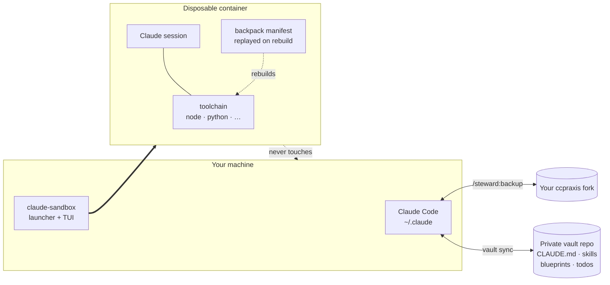

<div align="center">

# PRAXIS for Claude Code

**P**rompts, **R**ules, **A**gents, e**X**tensions, **I**ntegrations, **S**kills

A Claude Code configuration: plugins, hooks and a launcher script, covering an optional
isolated container, plans that survive a session ending, and syncing your setup across
machines.

[](https://www.perl.org/)
[](#platforms)
[](#quick-start)
[](LICENSE)
[](https://github.com/andrecarini/ccpraxis/stargazers)
[](https://github.com/andrecarini/ccpraxis/commits/main)

</div>

---

## Contents

- [Problems it addresses](#problems-it-addresses)
- [Capabilities](#capabilities)
  - [An isolated container for project tooling](#an-isolated-container-for-project-tooling)
  - [Plans that outlive one session](#plans-that-outlive-one-session)
  - [A nag against stopping early, and rules a hook enforces](#a-nag-against-stopping-early-and-rules-a-hook-enforces)
  - [Your setup, synced across machines](#your-setup-synced-across-machines)
- [On your machine](#on-your-machine)
- [See it](#see-it)
- [Quick start](#quick-start)
- [Commands](#commands)
- [Layout and documentation](#layout-and-documentation)
- [Platforms](#platforms)
- [Compared with alternatives](#compared-with-alternatives)
- [Fork it](#fork-it)

---

## Problems it addresses

| Problem | Detail |
|---|---|
| **Dev tooling on your machine is an attack surface** | One `npm install` runs arbitrary code from hundreds of packages, with your SSH keys, tokens and browser sessions a single `postinstall` away. |
| **A written rule is not enforcement** | An agent can ignore an instruction you gave it in a CLAUDE.md file. |
| **Long work loses its thread** | Anything spanning more than one session gets compacted, and what you decided (and why) goes with it. |
| **Agents stop early** | They report a plan, summarize what they would do, then end the turn with the work unfinished. |
| **Nothing travels** | New laptop, and your instructions, skills and project notes are elsewhere, much of it in files you deliberately kept out of the project repo. |

---

## Capabilities

### An isolated container for project tooling

Opt-in and set up per project; without it, Claude Code runs on your machine exactly as
normal. When a project has dependencies you'd rather not install directly, `claude-sandbox`
starts that session in a container instead, so `npm install` and everything it pulls runs
there. Install scripts are disabled for npm; pnpm packages must also be at least 7 days
old before they install. Neither control applies to the host. What you install in the
container is recorded in a **backpack**, a manifest replayed on rebuild, so throwing the
container away costs one command instead of an afternoon.

### Plans that outlive one session

`/blueprint:create` turns an objective into a **blueprint**: a plan on disk rather than
held in the conversation, split into **packages**, bounded chunks of work, each with a
**write set** (the files it may touch), dependencies, and pass/fail criteria specific
enough to check mechanically, then audited by an agent that never sat in the conversation
that produced it. Each package keeps a **ledger**, an on-disk record of what was decided
and why, so a compacted or restarted session picks up from the file instead of from memory
that's gone.

**butler** is the plugin that executes a blueprint once it exists. `/butler:dispatch-fleet`
runs one unattended, sandbox-only: a plain script, not itself an agent, launches one Claude
session per package, restarts one that dies, waits out rate limits, and resumes on its own.
`/butler:drive-solo` runs the same execution one package at a time in your own session, on
the host or in the sandbox.

### A nag against stopping early, and rules a hook enforces

Arm a session with `/butler:continuity on` and a hook blocks a turn from ending unless
something is scheduled to resume the work or you've explicitly disarmed it; reporting a
plan without doing the work does not satisfy it. It is a persistent nag rather than an
absolute gate: it yields after three consecutive blocks, and you can override it for a
single turn with a marker file or for a whole session with an environment variable.

Hooks also deny commands that destroy work faster than you can react to them. `git stash`,
`reset`, `checkout` and `clean` are refused outright, which protects work on ccpraxis
itself; add the same registration to another project's `.claude/settings.json` to get it
there. On Windows, `> NUL` from Bash is blocked, because it creates a file Explorer cannot
delete.

### Your setup, synced across machines

**steward** is the plugin that looks after ccpraxis itself. Its `/steward:backup` syncs your
live `~/.claude/` configuration against this repo, diffing semantically and scanning for
secrets before anything is pushed. A separate **vault**, a
private git repository you create and own, holds what can't live in a public project repo:
global CLAUDE.md, project-specific Claude files, skills, blueprints, todos. It syncs with
three-way merge and a pre-push secret scan, and never deletes a local file the vault has
never held.



---

## On your machine

Installing clones this repo to `~/.claude/ccpraxis`, symlinks (junctions on Windows) every
skill into `~/.claude/skills/`, creates or merges `~/.claude/CLAUDE.md` and
`~/.claude/settings.json`, installs the plugins listed there, and puts `claude-sandbox` on
your PATH: on Windows via the User-scope `PATH`/`PATHEXT` registry values (no admin
needed), on macOS/Linux by appending one line to your shell rc. If given a vault URL it
also clones that repo to `~/.claude/claude-code-vault/`. It prints a plan of every change
first and only touches your system once you re-run it with `--confirm`; nothing needs
npm, pip, or any other dev tooling on your machine, the installer is Perl only.

There's no automated uninstaller. To back out by hand: delete `~/.claude/ccpraxis`, remove
the PATH entry (Windows: User Environment Variables in System Properties; macOS/Linux:
the appended shell rc line), remove the symlinks/junctions under `~/.claude/skills/`, and
restore `~/.claude/CLAUDE.md`/`settings.json` from a backup. **Take that backup yourself
before installing.** The installer shows you every change and waits for `--confirm`, but it
does not copy your existing files aside first. Your vault repo is untouched either way.

---

## See it

The launcher opens a live dashboard. Real output, 80 columns:

```text
[⣄ running] ccpraxis sandbox · ccpraxis · claude-ccpraxis-8f21ab3
─ Run ──────────────────────────────────────────────────────────────────────────
heartbeat     <1m ago
uptime        3h02m
busy-lease    none (no active run)
keep-awake    released (PC may sleep)
machine       running (podman-machine-default)
podman        imgs 2.8 GB  ctrs 15.0 GB  vols 429.5 MB

─ Resources ────────────────────────────────────────────────────────────────────
snapshot      fresh, <1m old
ctr mem       ━━━━──────  36%    4.0 GB used |   7.1 GB free |  11.2 GB total
ctr cpu       ━━━───────  30%
host ram      ━─────────  10%    2.7 GB used |  24.6 GB free |  27.4 GB total
host disk     ━━━───────  28%   76.6 GB used | 197.0 GB free | 273.6 GB total
host cpu      ━━━━━━━━━─  85%

─ Providers ────────────────────────────────────────────────────────────────────
Claude Code
  access      expires in 7h17m
 the resources sampler has not written a snapshot for 4 minutes  [d] dismiss
 host disk above 90% -- podman image pulls will start failing  [d] dismiss
────────────────────────────────────────────────────────────────────────────────
 [c] launch Claude Code  [s] stop runs  [x] shutdown  [r] reload  [q] quit
```

<!-- SCREENSHOT: the sandbox TUI running in a real terminal -->
<!-- SCREENSHOT: /steward:backup resolving a settings conflict -->

---

## Quick start

**Fork first.** ccpraxis is configuration you'll want to own; forking means your edits are
yours and you can still pull upstream.

1. Fork [`andrecarini/ccpraxis`](https://github.com/andrecarini/ccpraxis).
2. *(Recommended)* Create an empty **private** repo for your vault, e.g. `claude-code-vault`.
3. Open Claude Code and say:
   > Install ccpraxis from `https://github.com/<you>/ccpraxis`. My vault repo is
   > `git@github.com:<you>/claude-code-vault.git`.
4. Stay at the terminal for the two confirmation gates (a settings diff, then the install
   plan described above), then restart Claude Code.

**Requirements:** Claude Code, Git, and Perl 5.14+ (already present on macOS/Linux and
inside Git for Windows), plus Docker or Podman if you want the sandbox. Claude follows
[`docs/install-protocol.md`](docs/install-protocol.md) to do the install; that page is the
same procedure step by step if you'd rather drive it yourself.

---

## Commands

| Command | Purpose |
|---|---|
| `claude-sandbox` | Launch the container + dashboard (run from a terminal, not inside Claude) |
| `/steward:backup` | Sync config and every registered vault project |
| `/steward:setup-project` | Track this project's Claude files in your vault |
| `/blueprint:create` | Turn an objective into an audited, on-disk plan |
| `/butler:dispatch-fleet` | Execute a blueprint with detached sessions per package (sandbox only) |
| `/butler:drive-solo` | Execute one interactively, on the host or in the sandbox |
| `/butler:continuity on` | Refuse to end a turn with work outstanding |
| `/backpack:add` | Record a tool so container rebuilds restore it |

The rest, including `/todo`, `/almanac`, and `/steward:ccpraxis-extend`, are listed with
every other surface in [`docs/reference.md`](docs/reference.md).

---

## Layout and documentation

Plugins live under `plugins/<name>/` (`sandbox`, `backpack`, `blueprint`, `butler`,
`steward`, `todo`, `almanac`); skills under `skills/`; the `CLAUDE.md` and
`settings.json` this installs to `~/.claude/` under `global-config/`. Everything here is
Perl, deliberately: it ships with macOS, Linux, and Git for Windows, so a fresh
`git clone` runs the whole system without installing a runtime on your host.

| Page | For |
|---|---|
| [Reference](docs/reference.md) | How each surface works: install contract, commands, statusline, backup, vault sync, sandbox, backpack |
| [Repo layout](docs/repo-layout.md) | Every file, annotated and generated from disk |
| [Design conventions](docs/design-conventions.md) | Packaging, approval flows, and what gets enforced in code |

## Platforms

macOS, Linux, and Windows are all supported; on Windows the launcher is PowerShell and
locates Perl itself.

> **Windows: use the WSL2 backend, not Hyper-V.** Microsoft's `Plan9FileServer` silently
> breaks `O_APPEND` and `utimensat`, which fails `claude --resume` and wedges Bun's lock
> manager. The bootstrap refuses `podman + hyperv` outright.

---

## Compared with alternatives

### The sandbox, versus Claude Code's own isolation options

Claude Code ships [several isolation approaches](https://code.claude.com/docs/en/sandbox-environments)
that solve a different problem than the sandbox above does. The
**[sandboxed Bash tool](https://code.claude.com/docs/en/sandboxing)** is a permission
boundary, not an environment: it confines what Bash commands may read, write and reach,
but leaves you in whatever environment you're already in, covers only Bash (*"Built-in
file tools, MCP servers, and hooks still run directly on your host"*), and has no native
Windows support (*"On Windows, run Claude Code inside a WSL2 distribution"*).
**[Dev containers](https://code.claude.com/docs/en/devcontainer)** do isolate the full
environment, genuinely equivalent to the sandbox above; the difference is what surrounds
it:

|  | Dev container | ccpraxis |
|---|---|---|
| Who drives it | an editor that supports the spec | a terminal launcher |
| Rebuilds | edit the Dockerfile, then rebuild | the backpack replays every declared install |
| Auth across rebuilds | *"the container's home directory is discarded on rebuild"* unless you mount a volume yourself | handled by the launcher |
| Supply chain | whatever your image does | install scripts disabled for npm/pnpm; a 7-day minimum package age for pnpm |

Anthropic's own warning about dev containers applies here too: *"dev containers do not
prevent a malicious project from exfiltrating anything accessible inside the container,
including the Claude Code credentials stored in `~/.claude`."* A container bounds the
blast radius; it does not make hostile code safe to run.

### Continuity, versus `/goal`

[`/goal`](https://code.claude.com/docs/en/goal) sets a completion condition and keeps
Claude working toward it (*"After each turn, a small fast model checks whether the
condition holds"*) and needs no setup. Its check runs after each turn, so it depends on a
next turn happening at all, which doesn't help a session wedged on a command with no
timeout. Continuity ends only when you disarm it, and for unattended blueprint runs the
watchdog sits outside the session entirely: `bp-orchestrator.pl`, a plain script spending
no tokens, detects a session that's alive but producing no output and kills and
relaunches it rather than waiting for a turn that will never come.

---

## Fork it

ccpraxis is meant to be forked. Change what you disagree with and pull upstream for fixes:

```bash
cd ~/.claude/ccpraxis
git remote add upstream https://github.com/andrecarini/ccpraxis.git
git fetch upstream && git merge upstream/main
```

Then run `/steward:backup` to resync your live config.

---

<div align="center">

Licensed under [Apache 2.0](LICENSE).

</div>
